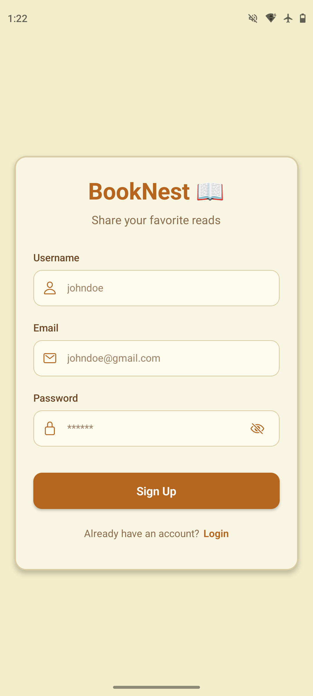
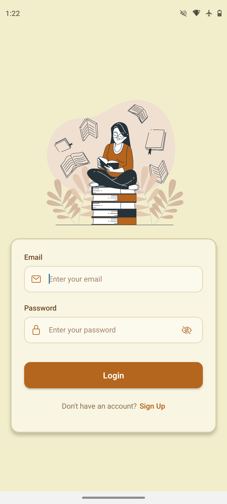
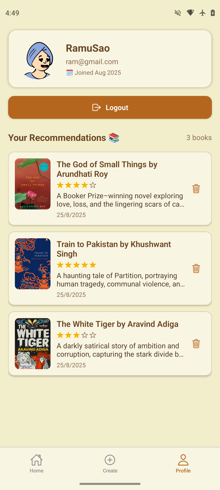
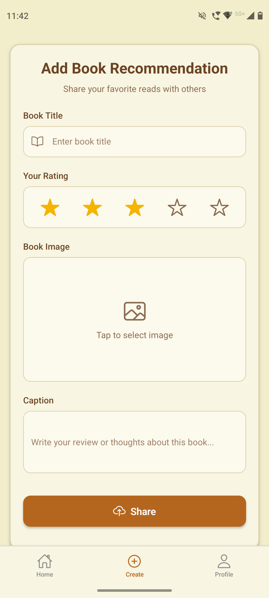
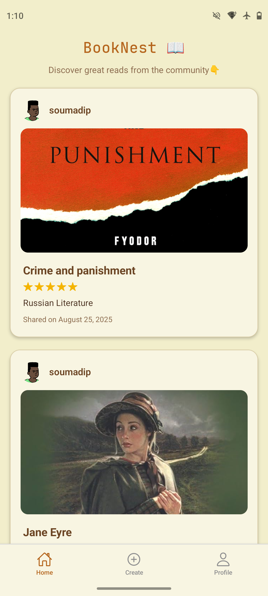

<h1 align="center">
  <br>
  📚 BookNest (RN-MERN) 📖
  <br>
</h1>

<div align="center">
  
</div>

<p align="center">
  A beautiful book tracking mobile app built with React Native (Expo). Organize your reading list, track progress, and discover new books.
</p>

<div align="center">

| Signup                                                                                            | Login                                                                                           | Profile                                                                                             | Create                                                                                            | View                                                                                          |
| ------------------------------------------------------------------------------------------------- | ----------------------------------------------------------------------------------------------- | --------------------------------------------------------------------------------------------------- | ------------------------------------------------------------------------------------------------- | --------------------------------------------------------------------------------------------- |
|  |  |  |  |  |

</div>

## ✨ Features (Planned)

- 🔐 **Authentication**: Signup & login with JWT, error handling for bad credentials
- 🏠 **Home Feed**: Newest-first posts with infinite scrolling
- ➕ **Create Post**: Title, rating, cover image & caption (all required)
- 👤 **Profile Screen**: User info + their posts
- 🗑️ **Delete Post**: Confirmation alert before removal
- 🎨 **Themes**: 4 instant themes - just swap one color object
- 🌐 **Web Support**: Run on localhost in the browser
- 👋 **Logout**: Clears localStorage and redirects to login screen

## 🛠️ Tech Stack

- **Frontend**: React Native, Expo, TypeScript, Tailwind CSS
- **Backend**: Node.js with Express – RESTful API
- **Database**: MongoDB with Mongoose
- **Cloud Deployment**: Backend hosted online, accessible by mobile

## ⚙️ Installation & Setup

### Prerequisites

- Node.js (v18 or higher)
- npm or yarn
- MongoDB database (e.g., MongoDB Atlas)

### Setup

1. **Clone the repository**

   ```bash
   git clone https://github.com/soumadip-dev/BookNest-RN-MERN.git
   cd BookNest-RN-MERN
   ```

2. **Backend Setup**

   ```bash
   cd server
   npm install
   ```

   Create a `.env` file in the `server` directory with:

   ```env
   PORT=8080
   MONGO_URI=<your_mongodb_uri>
   JWT_SECRET=<your_secret_key>
   CLOUDINARY_CLOUD_NAME=<your_cloud_name>
   CLOUDINARY_API_KEY=<your_api_key>
   CLOUDINARY_API_SECRET=<your_api_secret>
   ```

3. **Frontend Setup**

   ```bash
   cd ../mobile
   npm install
   ```

4. **Run the Application**

   - Backend (Terminal 1):
     ```bash
     cd server
     npm run dev
     ```
   - Frontend (Terminal 2):
     ```bash
     cd ../mobile
     npm start
     ```
