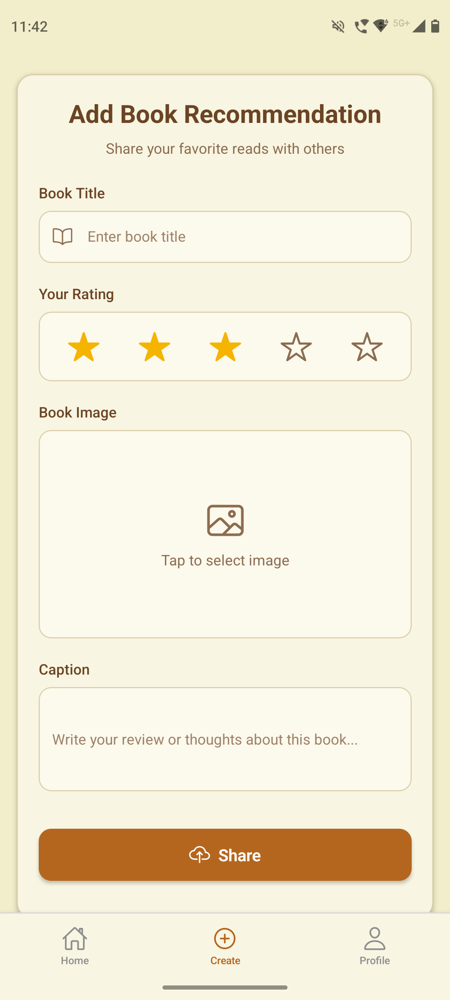

<h1 align="center">
   
  📚 BookNest (RN-MERN) 📖
   
</h1>

  

  A beautiful book tracking mobile app built with React Native (Expo). Organize your reading list, track progress, and discover new books.

| Signup                                                                                            | Login                                                                                           | Profile                                                                                     | Create                                                                                            | View                                                                                          |
| ------------------------------------------------------------------------------------------------- | ----------------------------------------------------------------------------------------------- | ------------------------------------------------------------------------------------------- | ------------------------------------------------------------------------------------------------- | --------------------------------------------------------------------------------------------- |
|  |  |  |  |  |

🚧 Currently Building 🚧

## ✨ Features (Planned)

- 🔐 **Authentication**: Signup & login with JWT, error handling for bad credentials
- 🏠 **Home Feed**: Newest-first posts with infinite scrolling
- ➕ **Create Post**: Title, rating, cover image & caption (all required)
- 👤 **Profile Screen**: User info + their posts
- 🗑️ **Delete Post**: Confirmation alert before removal
- 🎨 **Themes**: 4 instant themes - just swap one color object
- 🌐 **Web Support**: Run on localhost in the browser
- 👋 **Logout**: Clears localStorage and redirects to login screen

## 🛠️ Tech Stack

- **Frontend**: React Native, Expo, TypeScript, Tailwind CSS
- **Backend**: Node.js with Express – RESTful API
- **Database**: MongoDB with Mongoose
- **Cloud Deployment**: Backend hosted online, accessible by mobile
